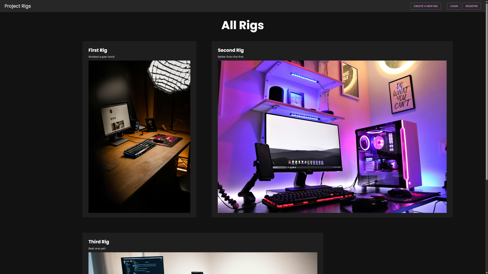
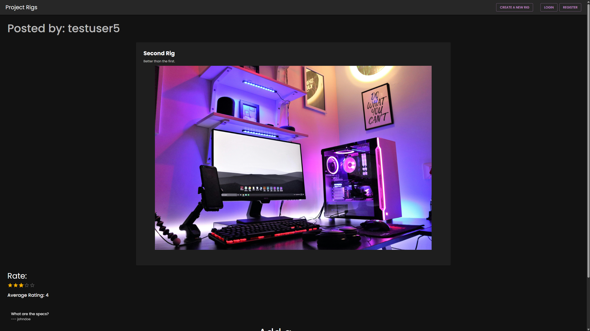

# Project Rigs

A full-stack, image-oriented social media application where users can post pictures of their computer setups, and other users can comment on and rate them.

**Live Demo:** https://project-rigs.vercel.app/

**Technologies:** Next.js • Python • Django • MongoDB • GraphQL • JWT • Material-UI



A screenshot of the main homepage showing a gallery of rig posts.



A screenshot of the detail page for a specific rig, showing comments and ratings.


A screenshot of the page that lists all the rigs created by a specific user.

## Features

- **User Authentication:** Secure user registration and login using JWT (JSON Web Tokens)
- **Image Uploads:** Seamless image uploads directly from the browser to Cloudinary for fast, optimized hosting
- **Social Interaction:** Users can post comments and leave a 1-5 star rating on any rig
- **Dynamic User Profiles:** View a gallery of all rigs posted by a specific user
- **Modern API:** Built with GraphQL for efficient and precise data fetching between the frontend and backend
- **Polished User Experience:** A responsive, single-page application feel with a professional component library

## Tech Stack

### Backend
- **Language:** Python
- **Framework:** Django
- **Database:** MongoDB (NoSQL)
- **API:** GraphQL (using Graphene-Django)
- **Authentication:** JWT
- **Testing:** Pytest
- **Deployment:** Render

### Frontend
- **Framework:** Next.js (React)
- **Styling:** Material-UI (MUI)
- **API Client:** Apollo Client
- **Image Hosting:** Cloudinary
- **Deployment:** Vercel

## Local Setup and Installation

Follow these instructions to get the project running on your local machine.

### Prerequisites
- Python (v3.10 or later) & Pip
- Node.js (v18 or later)
- A code editor (e.g., VS Code)

### 1. Clone the Repository
```bash
git clone https://github.com/YOUR_USERNAME/project-rigs.git
cd project-rigs
```

### 2. Backend Setup
```bash
# Create and activate a Python virtual environment
python -m venv venv
source venv/bin/activate  # On Windows: venv\Scripts\activate

# Install dependencies
pip install -r requirements.txt

# Create a .env file in the project root directory with the following variables:
# SECRET_KEY=your_django_secret_key
# MONGODB_HOST=your_mongodb_atlas_connection_string

# Start the backend server
python manage.py runserver
```

The backend will be running at `http://localhost:8000`.

### 3. Frontend Setup
```bash
# Navigate to the frontend directory from the root
cd frontend

# Install dependencies
npm install

# Create a .env.local file in the /frontend directory with the following variables:
# NEXT_PUBLIC_CLOUDINARY_CLOUD_NAME=your_cloudinary_cloud_name
# NEXT_PUBLIC_CLOUDINARY_UPLOAD_PRESET=your_cloudinary_upload_preset

# Start the frontend development server
npm run dev
```

The frontend will be running at `http://localhost:3000`.

### 4. Environment Variables

#### Backend (.env)
```
SECRET_KEY=your_django_secret_key
MONGODB_HOST=your_mongodb_atlas_connection_string
```

#### Frontend (.env.local)
```
NEXT_PUBLIC_CLOUDINARY_CLOUD_NAME=your_cloudinary_cloud_name
NEXT_PUBLIC_CLOUDINARY_UPLOAD_PRESET=your_cloudinary_upload_preset
```

## Usage

1. **Register/Login:** Create an account or log in
2. **Create a Rig:** Click "New Rig," upload an image, and add a title/description
3. **Browse Rigs:** View all user-submitted rigs on the homepage
4. **View Details:** Click on any rig to see its dedicated page
5. **Comment and Rate:** Leave comments and a 1-5 star rating on any rig
6. **View Profiles:** Click on a user's name to see all the rigs they have posted

## GraphQL API

The application uses a single GraphQL endpoint at `/graphql` which supports the following queries and mutations.

### Queries
- `allRigs` - Fetches all rigs
- `rigById(id: ID!)` - Fetches a single rig by its ID
- `rigsByAuthor(username: String!)` - Fetches all rigs posted by a specific user

### Mutations
- `createUser(username, email, password)` - Registers a new user and returns a JWT
- `tokenAuth(username, password)` - Logs in a user and returns a JWT
- `createRig(title, description, imageUrl)` - Creates a new rig (authentication required)
- `addComment(rigId, text)` - Adds a comment to a rig (authentication required)
- `submitRating(rigId, rating)` - Adds a rating to a rig (authentication required)

## Contributing

1. Fork the repository
2. Create a feature branch (`git checkout -b feature/amazing-feature`)
3. Commit your changes (`git commit -m 'Add some amazing feature'`)
4. Push to the branch (`git push origin feature/amazing-feature`)
5. Open a Pull Request

## Contact

**Zaid Ahmed** - zaahme18@gmail.com

**Project Link:** https://github.com/ZA1815/project-rigs
